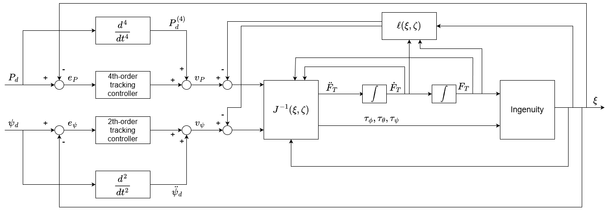

# Dynamic Feedback Linearization of Ingenuity

This repository contains the MATLAB simulation scripts for the project Dynamic Feedback Linearizability of Ingenuity," developed for the Modeling and Control of Multirotor UAVs course at Sapienza University of Rome by *Luca Franzin*, *Andrea Gravili*, *Giuseppe D'Addario*, and *Federico Tranzocchi*.

The project focuses on designing a trajectory tracking controller for a co-axial helicopter, modeled after NASA's Ingenuity Mars helicopter. Due to the underactuated, nonlinear, and coupled dynamics of the vehicle, a nonlinear control technique known as *Dynamic Feedback Linearization* (**DFL**) is implemented.

## Project overview

The core of this project is the derivation and implementation of a DFL controller to achieve precise trajectory tracking for a 12-state helicopter model. The key findings are:

-   The system has a **relative degree of 4** for the position outputs and **2** for the yaw output.
-   A **second-order dynamic compensator** is required on the thrust input channel to achieve full-state linearization.
-   The total relative degree of the extended system is 14, which matches the dimension of the extended state space (12 plant states + 2 compensator states), meaning the system is **fully state linearizable with no zero dynamics**.

The repository provides the code to simulate the closed-loop dynamics under the DFL controller. It also contains the code for the open-loop dynamics of Ingenuity, but it was used only for initial testing before the application of the controlled system.

## File structure

```
.
├── main.m                      # Main script to run the closed-loop DFL simulation
│
├── ingenuity_closed_loop.m     # Function defining the complete closed-loop dynamics with the DFL controller
├── ingenuity_open_loop.m       # Function defining the open-loop plant dynamics
│
├── traj_utils.m                # Helper function to generate reference trajectories
│
├── latex/
│   ├── main.pdf                # The final project report
│   └── ... (LaTeX source files)
├── docs/
│   ├── io_linearization.pdf    # Study of the dynamic feedback linearizability of Ingenuity
│   └── ...                     # Other reference files (course slides, papers) cited in the final report and used for this project
│
└── README.md                   # This file
```

## How to run the simulation

This is the main simulation that demonstrates the performance of the DFL trajectory tracking controller.

1.  Open MATLAB.
2.  Navigate to the repository's root directory.
3.  Open the `main.m` script.
4.  Inside `main.m`, you can choose the desired trajectory by setting the `trajectory_type` variable.
5.  Run the `main.m` script.
6.  The script will run the simulation and generate plots showing the helicopter's performance, including the 3D trajectory, tracking errors, and control inputs.

## Code description

### Dynamic model
`ingenuity_open_loop.m` contains the 12-state nonlinear model of the helicopter based on Newton-Euler equations.
-   **State Vector**: $\boldsymbol{\xi} = (\boldsymbol{P}; \boldsymbol{V}^b; \boldsymbol{\Theta}; \boldsymbol{\omega}) \in \mathbb{R}^{12}$
-   **Input Vector** $\boldsymbol{u} = (F_T; \tau_\phi; \tau_\theta; \tau_\psi) \in \mathbb{R}^{4}$

### DFL Controller
`ingenuity_closed_loop.m` implements the full DFL control architecture.
-   **Extended state**: $\boldsymbol{\xi} = (\boldsymbol{\xi}; F_T; \dot{F}_T)$
-   **Outer loop:** Calculates the virtual control $\boldsymbol{\nu}$ based on tracking errors up to the jerk level.
-   **Inner loop:** Computes the state-dependent decoupling matrix $\boldsymbol{J}(\boldsymbol{\xi}, \boldsymbol{\zeta})$ and drift vector $\boldsymbol{l}(\boldsymbol{\xi}, \boldsymbol{\zeta})$, and solves the inverse dynamics to find the commanded torques and the second derivative of thrust $\ddot{F}_T$.
-   **Dynamic compensator:** The commanded $\ddot{F}_T$ is integrated by the ODE solver to update the compensator states $(F_T, \dot{F}_T)$, which are then used as inputs to the plant model.



### Trajectory generation
`traj_utils.m` is a utility that provides the reference position and its derivatives up to the snap $(P_d, \dot{P}_d, \ddot{P}_d, P_d^{(3)}, P_d^{(4)})$, as well as the reference yaw and its derivatives. It supports multiple trajectory types for testing.

## Report

The `latex/` directory contains the final project report in PDF format (`main.pdf`) along with all the LaTeX source files used to generate it. The report provides a detailed theoretical background, the full mathematical derivation of the DFL controller, and an analysis of the simulation results.
